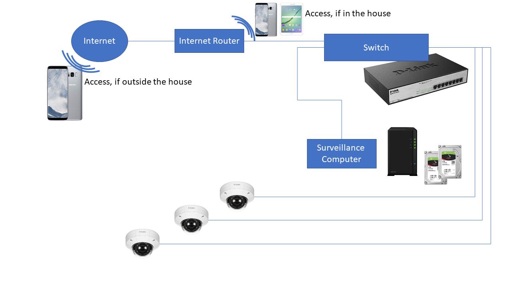

# Home-NVR-Setup-Guide-SmartHome-Automation

I want to equip my home with a surveillance system that I can access from anywhere. This project is a 101 to set up a synology surveillance station with IP cameras

## Components i used

| Components | Description  | Ammount | Link |
| ------------- | ------------- | ------------- | ------------- |
| Surveillance Computer | Synology NVR1218  | 1  | |
| Surveillance Computer | Synology surveillance licence**  | 1  | |
| Harddisc | WD Purple HDD 4TB | 2 | |
| Switch | D-Link Gigabit Switch, 8x RJ-45, PoE+ (DGS-1008MP) | 2 | |
| IP Cam | D-Link DCS-4633EV | 5 | |

** The first 4 surveillance licences are included when buying a NVR1218 -  to install more IP Cams you have to buy more licences

The cabling is carried out as followed:

---
## Setup IP Cams
I had a lot of trouble setting up the IP cameras at first. So here is a step by step guide

To access the installad IP Cams you need the D-Link SetupWizardSE software (you can find the CD supplied with the product)
